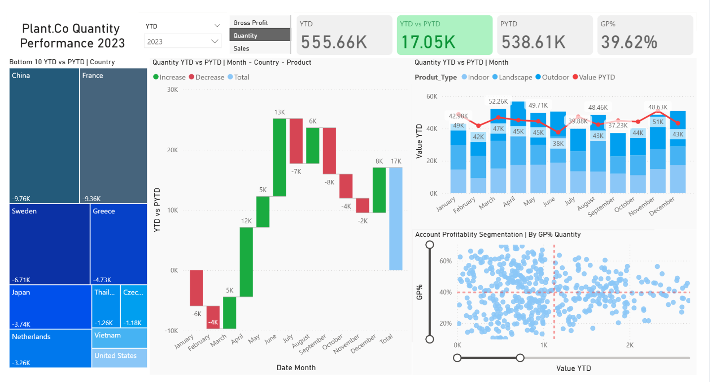

# Plant Performance Dashboard (Power BI)

## Project Overview
This project analyzes company sales and profitability performance using Power BI.
The dashboard compares current year performance (YTD) with previous year (PYTD) and identifies trends, growth and declines.

## Tools Used
- Power BI
- Power Query (Data Cleaning & Transformation)
- DAX Measures

## Key Metrics
- YTD Quantity
- PYTD Quantity
- Gross Profit
- GP% (Profit Margin)

## Analysis Performed
- Country performance comparison
- Monthly trend analysis
- YTD vs PYTD growth analysis
- Profitability segmentation
- Increase/Decrease analysis using waterfall chart

## Business Insights
- Identifies top performing countries
- Detects months with declining performance
- Shows profitability differences between products and customers
- Helps management track operational performance

## Dashboard Preview

